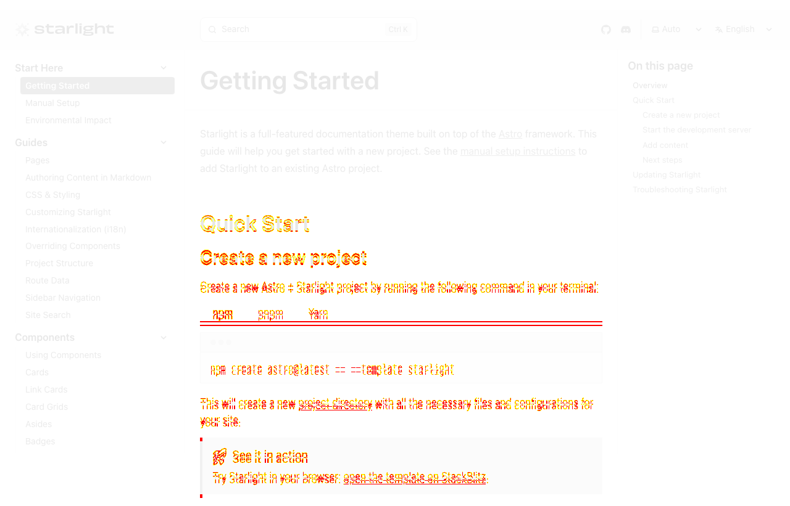

<div align="center">
  <h1>starlight-visual-diff 🖼️</h1>
  <p>Compare Starlight documentation pages for visual differences.</p>
</div>

Useful when working on large refactors, dependency upgrades, or other changes that should not change the visual appearance of documentation pages.

## Getting Started

1. Clone the repository
1. Install dependencies:
   ```bash
   pnpm install
   ```
1. Configure the tool in the `config.ts` file.
   - `baseUrl` defines the base URLs of the baseline and candidate versions to visually compare. These URLs can be local development servers or deployed environments.
   - `paths` defines the list of routes to visually compare between the baseline and candidate versions.
1. Run the visual diff:
   ```bash
   pnpm start
   ```

After running the tool, the terminal output will list all routes with visual differences between the baseline and candidate versions. For each route with visual differences, the terminal output includes the path to a diff image.

The following diff image shows visual differences caused by a small heading `line-height` change. Because the text takes up more vertical space, the layout shifts progressively further down the page.



## Caching

Baseline screenshots are cached between runs. Changes to the baseline site or rendering environment can make cached screenshots outdated and cause unexpected visual differences.

For example, on macOS, connecting a mouse with the _Show scroll bars_ setting set to _Automatically based on mouse or trackpad_ can change sidebar spacing without any changes to the page code.

To delete all screenshots, including cached ones, use the `clean` script before running the visual diff again.

```bash
pnpm clean
pnpm start
```

## License

Licensed under the MIT License, Copyright © HiDeoo.

See [LICENSE](https://github.com/HiDeoo/starlight-visual-diff/blob/main/LICENSE) for more information.
